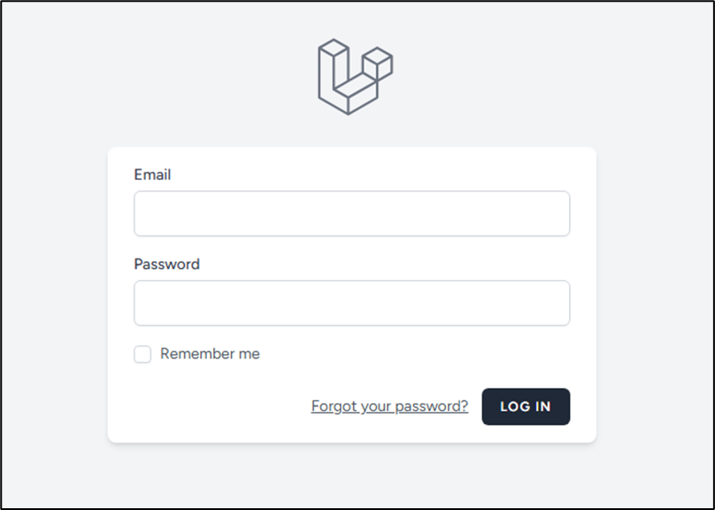
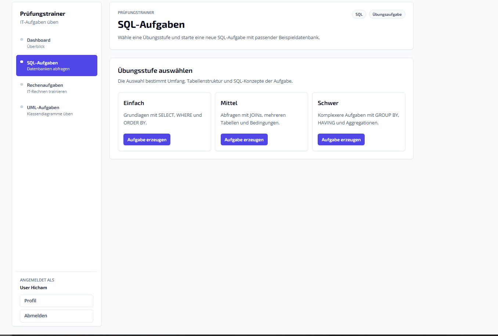
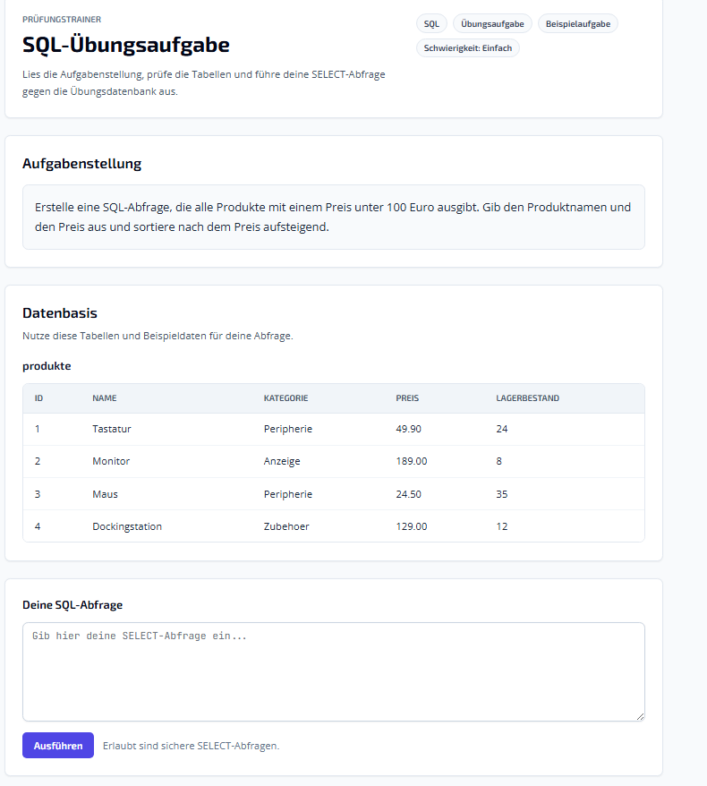

# Prüfungstrainer

**Prüfungstrainer** is a modular, locally hosted AI-powered learning platform for technical education and IT exam preparation.

The platform combines a Laravel web application with a dedicated Python-based AI Gateway to generate structured learning tasks, execute selected exercises in the browser, and provide model-generated reference solutions for self-assessment.

The project focuses on privacy, reproducibility, maintainability, and extensibility.

---

## Overview

Prüfungstrainer helps learners prepare for technical and IT-related exams by generating practice tasks for different exercise types, such as SQL, UML, and calculation tasks.

Unlike static worksheets or fixed question banks, the system can generate new task variations dynamically through a locally running language model. The generated output is normalized and validated before it is used by the Laravel application.

The first version of the project was developed as a functional prototype for IT education and exam preparation.

---

## Core Goals

* Provide a browser-based learning environment for IT-related practice tasks
* Generate realistic and structured exercises using a local AI model
* Keep all AI processing local through Ollama
* Validate AI output before using it in the application
* Separate web application logic from AI orchestration
* Support future extension with additional task types and models

---

## Key Features

* AI-generated exercises for technical education
* SQL practice tasks with temporary exercise databases
* In-browser SQL query execution
* UML task support with PlantUML rendering
* Calculation exercises for technical and business-related scenarios
* Structured JSON-based AI responses
* AI output validation and normalization
* Local AI execution through Ollama
* Laravel-based web interface
* Python-based AI Gateway
* Modular architecture for future task categories

---

## Architecture

The system is split into two main layers:

### 1. Laravel Web Application

The Laravel application is responsible for:

* User interface
* Routing and controllers
* Exercise rendering
* Database access
* SQL exercise execution
* Task category handling
* Displaying tasks, user input, and reference solutions

### 2. AI Gateway

The AI Gateway is a separate Python service responsible for:

* Prompt construction
* Communication with local AI models
* JSON validation
* Response normalization
* Schema enforcement
* Future model routing
* Future caching and benchmarking

This separation keeps the Laravel application focused on web and business logic while the AI Gateway handles AI-specific concerns.

---

## High-Level Data Flow

```text
User
  ↓
Laravel Web Application
  ↓
AI Gateway
  ↓
Ollama / Local LLM
  ↓
AI Gateway validates and normalizes JSON
  ↓
Laravel stores and renders the task
  ↓
User solves the exercise in the browser
  ↓
Laravel displays result and reference solution
```

---

## Example AI Response

The AI Gateway expects structured JSON responses. A normalized SQL exercise response can look like this:

```json
{
  "task": "Write a SQL query that lists all customers with orders above 1000€.",
  "mysqlstatement": "CREATE TABLE customers (...); INSERT INTO customers (...);",
  "solution": "SELECT ... FROM customers JOIN orders ON ...;"
}
```

The response is validated before being forwarded to the Laravel application.

---

## Technology Stack

### Web Application

* Laravel
* PHP 8.2+
* MySQL
* Blade
* Composer
* Vite

### AI Gateway

* Python
* FastAPI
* Ollama
* Local language models
* JSON schema validation

### Diagram Rendering

* PlantUML
* Java Runtime Environment

### Development Tools

* Git
* GitHub
* Visual Studio Code
* XAMPP or comparable local development environment

---

## Repository Structure

```text
app/                Laravel application code
routes/             Laravel route definitions
database/           Migrations, seeders, and database structure
resources/views/    Blade templates
docs/               Project and technical documentation
ai-gateway/         Python-based AI Gateway
tests/              Automated tests
```

---

## Screenshots

### Login Interface



### Dashboard



### SQL Practice Interface



---

## Requirements

The project requires the following components:

* PHP 8.2 or higher
* Composer
* Node.js and npm
* MySQL
* Python 3.10 or higher
* Ollama
* Java Runtime Environment
* PlantUML

---

## Installation

Detailed installation steps should be documented in:

```text
docs/INSTALLATION.md
```

A typical local setup requires two running services:

1. Laravel web application
2. Python AI Gateway

Ollama must also be running locally and must provide the configured model.

---

## Local Development

### Start the Laravel application

```bash
composer install
npm install
php artisan migrate
npm run dev
php artisan serve
```

### Start the AI Gateway

```bash
cd ai-gateway
python -m venv .venv
.venv\Scripts\activate
pip install -r requirements.txt
uvicorn app.main:app --reload --port 8001
```

### Start Ollama

```bash
ollama serve
```

Pull the required model if it is not installed yet:

```bash
ollama pull mistral:7b
```

---

## Environment Configuration

Configuration values should be stored in the Laravel `.env` file and the AI Gateway environment configuration.

Example values:

```env
OLLAMA_MODEL=mistral:7b
AI_GATEWAY_URL=http://127.0.0.1:8001
```

Database credentials and other secrets must not be committed to the repository.

---

## Security Considerations

* AI execution is fully local through Ollama
* No external AI API is required
* Generated SQL tasks are executed in isolated temporary databases
* User-submitted SQL should be restricted to safe query types
* AI responses are validated before further processing
* Sensitive configuration is stored in environment files
* Temporary databases should be cleaned up automatically
* Error messages should be user-friendly and avoid exposing internal details

---

## Current Limitations

* The current version is a functional prototype
* Automated grading for open-ended UML or text-based tasks is not implemented
* UML solutions are mainly compared through reference output
* Advanced role and permission management is not part of the first version
* Mobile optimization is not the main focus
* AI output quality depends on the configured local model and prompt design

---

## Extensibility

The platform is designed to support future extensions, including:

* Additional exercise categories
* Difficulty-based task generation
* Fixture-based tasks
* Model routing
* Prompt versioning
* AI response caching
* Multi-model benchmarking
* Learning progress tracking
* RAG-based context integration
* Docker-based deployment
* Role-based permission system
* Integration with learning platforms such as Moodle

---

## Roadmap

* Add difficulty levels for exercises
* Improve prompt templates for SQL, UML, and calculation tasks
* Add more predefined fixture tasks
* Implement structured prompt versioning
* Add automated tests for the AI Gateway
* Add Docker support
* Improve SQL sandbox security
* Add model routing for different task types
* Add response caching
* Improve monitoring and logging
* Extend the system with additional IT-related exercise types

---

## Contribution Guidelines

* Use feature branches
* Keep pull requests focused and reviewable
* Do not commit secrets or local environment files
* Document new modules and services
* Keep AI responses schema-compliant
* Add or update tests when changing core logic
* Prefer small, maintainable changes over large unstructured commits

---

## License

This project is licensed under the GNU General Public License v3.0.

See the `LICENSE` file for details.

---

## Author

Hicham El Badr
